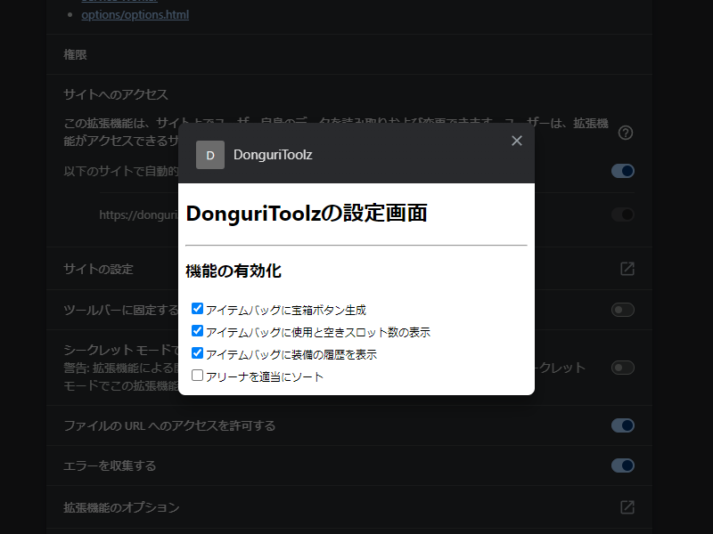
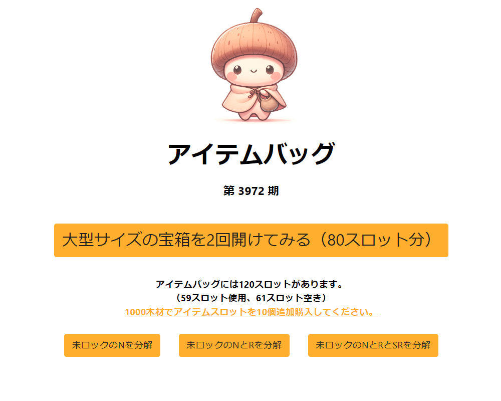
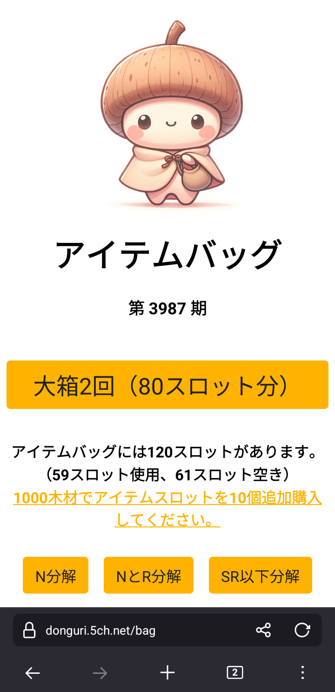
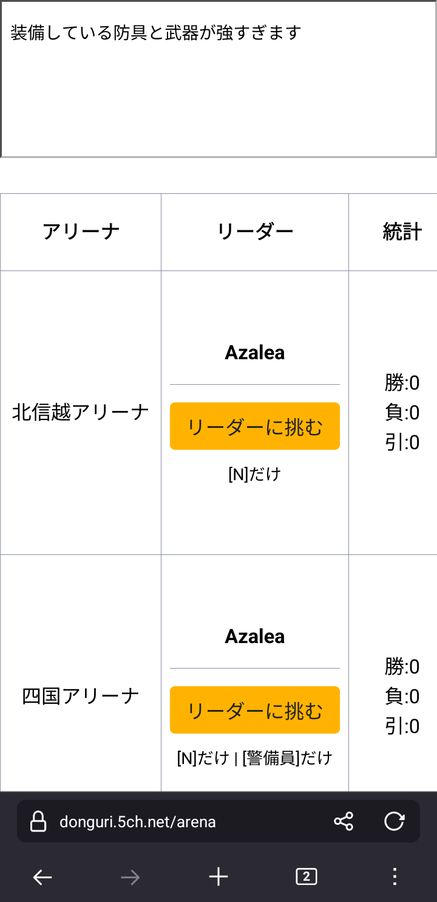

# DonguriToolz
どんぐりシステムを使いやすく勝手に改造

## 機能一覧
- アイテムバッグに宝箱ボタン生成
- アイテムバッグに使用と空きスロット数の表示
- アイテムバッグに装備の履歴を表示
- アイテムバッグにレアリティごとの分解ボタンを表示
- アリーナを適当にソート
- アリーナの挑戦結果を画面上に表示

## イメージ
<table>
<tr>
<td>
<td>
</tr><tr>
<td>
<td>
</tr>
</table>

## 使い方
1. 機能拡張のページよりオプションを表示する
2. 有効化したい機能にチェックをつける

## インストール
### Chrome
1. zipファイルを[ダウンロード](https://github.com/makoto-san-study/DonguriToolz/releases)する
2. zipファイルを解凍する
3. Chromeの拡張機能から「パッケージ化されていない拡張機能を読み込む」で解凍したディレクトリを指定する
### Firefox
1. zipファイルを[ダウンロード](https://github.com/makoto-san-study/DonguriToolz/releases)する
2. Firefoxの拡張機能から「一時的なアドオンを読み込む」でダウンロードしたzipファイルを指定する
3. 開発版Firefoxは「ファイルからアドオンをインストール」でダウンロードしたzipファイルを指定してもインストール可能
### Edge
1. zipファイルを[ダウンロード](https://github.com/makoto-san-study/DonguriToolz/releases)する（chrome用をダウンロード）
2. zipファイルを解凍する
3. 開発者モードにして、「展開して読み込み」で解凍したディレクトリを指定する
### Android版Firefox（Nightly）
1. xpiファイルを[ダウンロード](https://github.com/makoto-san-study/DonguriToolz/releases)する
2. デバッグメニューを有効にする（「Firefox Nightlyについて」にあるロゴを5回タップ）
3. ひとつ戻って「ファイルから拡張機能をインストール」でダウンロードしたxpiファイルを指定する

## アンインストール
アドオンなので削除してしまえば綺麗さっぱり消えます

## ライセンス
MIT License

